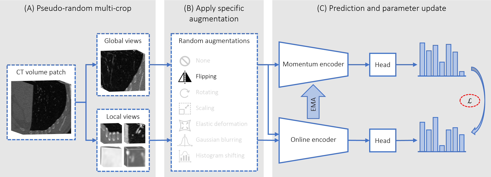

# Non-Contrastive Learning for 3D Medical Imaging

This repository contains the implementation of the paper "Evaluating Task Specific Augmentations in Self-Supervised 
Pre-Training for 3D Medical Image Analysis" which was accepted for SPIE Medical Imaging 2024 in San Diego, CA, USA.

## Overview

The project aims to evaluate the effectiveness of task-specific augmentations for self-supervised pre-training in 3D 
medical image analysis, however, can be used as a general framework for 3D pre-training for medical images. The codebase 
includes scripts for pre-training and downstream classification and segmentation
tasks. We follow self-supervised pre-training via a 3D non-contrastive approach, based on the DINO framework. The 
following figure displays a visual representation of the pre-training process as followed in the paper.



## Prerequisites

- Python 3.11 or above
- PyTorch 2.2 or above
- NumPy 1.26 or above
- MONAI 1.3 or above

## Installation

Clone the repository:

```bash
git clone https://github.com/cclaess/3DMedDINO.git
cd 3DMedDINO
```

Install the requered packages:

```bash
pip install -r requirements.txt
```

## Usage

### Pre-training
The pre-training script is `main_dino.py`. It uses data from the National Lung Screening Trial (NLST) dataset. For 
pre-training, the data should be stored in a directory with the following structure:

```bash
data
├── patient1
│   ├── t0
│   │   └── image0.hdf5
│   ├── t1
│   │   └── image1.hdf5
│   └── t2
│       └── image2.hdf5
├── patient2
│   └── ...
└── ...
```
Running the script with the following command will start the pre-training process for ViT-S using distributed data 
parallelism on 4 GPUs and save the model checkpoints to the specified output directory:

```bash
torchrun --nproc_per_node=4 main_dino.py \
                            --arch vit_small \
                            --data_dir /path/to/nlst/data \
                            --output_dir /path/to/output
```

### Downstream Classification and Segmentation
The downstream classification and segmentation tasks are implemented in `main_lnc_luna16.py` and 
`main_lts_msd.py` respectively. The data for the classification task should be stored in a directory with the following
structure:

```bash
data
├── subset0
│   ├── label0
│   │   ├── patient0
│   │   │   ├── image0.nii.gz
│   │   │   ├── image1.nii.gz
│   │   │   └── ...
│   │   ├── patient1
│   │   │   └── ... 
│   │   └── ...
│   └── label1
│       ├── patient0
│       │   ├── image0.nii.gz
│       │   ├── image1.nii.gz
│       │   └── ...
│       ├── patient1
│       │   └── ... 
│       └── ...
└── ...
```
Where each image is a crop around the lung region.

The data for the segmentation task should be stored in a directory with the following structure:

```bash
data
├── images
│   ├── image0.nii.gz
│   ├── image1.nii.gz
│   └── ...
└── labels
    ├── image0.nii.gz
    ├── image1.nii.gz
    └── ...
```

Running the classification script with the following command will start the classification process using the pre-trained
model and save the model checkpoints to the specified output directory:

```bash
torchrun --nproc_per_node=4 main_lnc_luna16.py \
                            --pretrained_weights /path/to/pretrained/model.pth \
                            --data_dir /path/to/lnc_luna16/data \
                            --output_dir /path/to/output
```

Running the segmentation script with the following command will start the segmentation process using the pre-trained
model and save the model checkpoints to the specified output directory:

```bash
torchrun --nproc_per_node=4 main_lts_msd.py \
                            --pretrained_weights /path/to/pretrained/model.pth \
                            --data_dir /path/to/lts_msd/data \
                            --output_dir /path/to/output
```

## Citation
A bibtex entry will follow once the proceedings are published. Please cite the paper if you use this code in your own
work.
